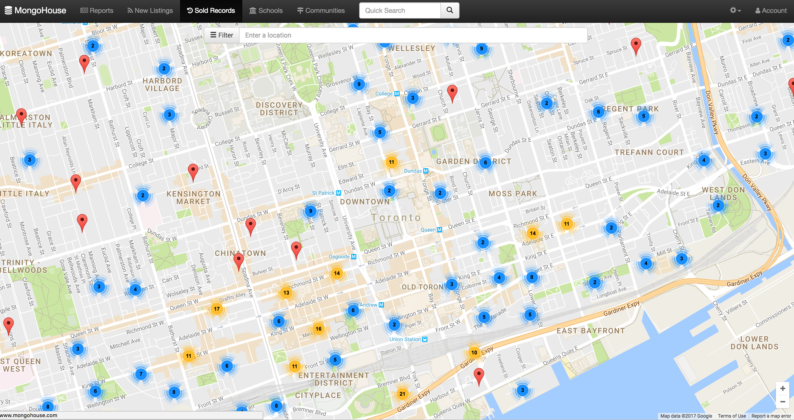
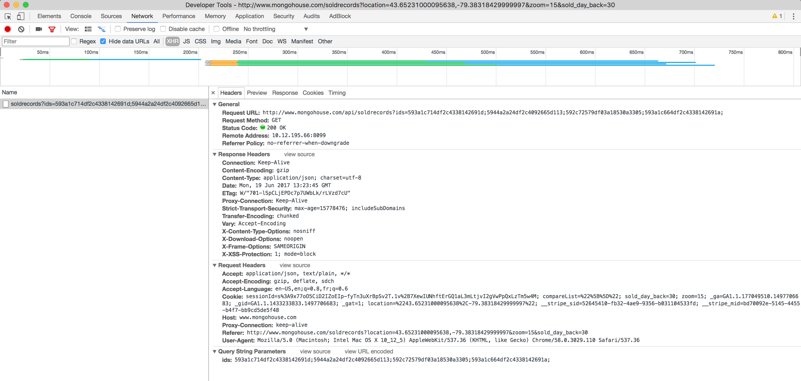
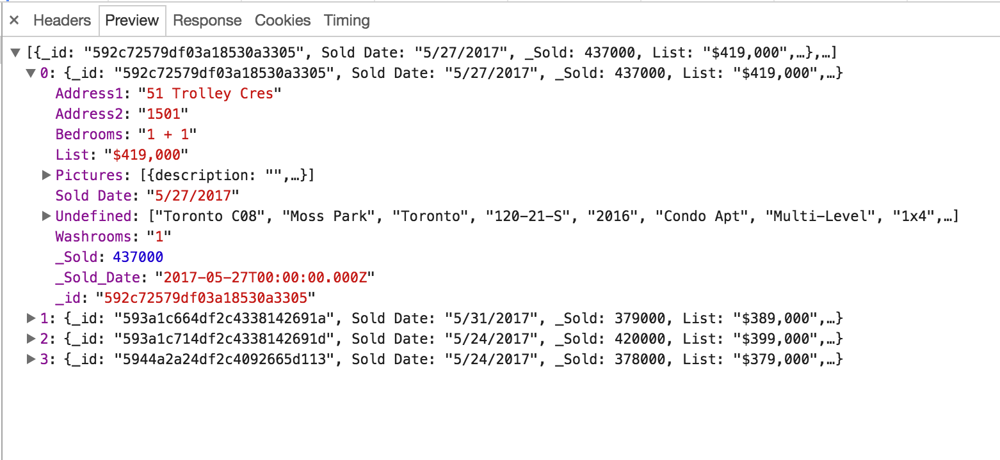

# toronto housing
[MongoHouse](http://www.mongohouse.com/) & [OhMyHome](http://watch.ohmyhome.ca) are real estate websites targeted at providing information on the Toronto/GTA housing market. One of the unique features of the site is that it includes sale prices, which is generally information that is only available to realtors.

Monitoring different areas of the Toronto housing market could be useful for understanding which areas have seen the highest price increases and could be prone to a correction. Alternatively, if & when a general housing market correction occurs, it would be useful to see which areas are hit the hardest.


## Getting the data

MongoHouse allows user to choose to view new listings or sold records, and displays the data in a map view.

<p align="center">

</p>

On Chrome, you can open up developer tools to view the web requests going on behind the scenes. As you can see in the picture below, a call is made to the MongoHouse API with the different property IDs passed in as parameters.

<p align="center">

</p>

And the response is a beautifully formatted JSON object:

<p align="center">

</p>

Lucky for us, MongoHouse uses client-side API calls to retrieve the data shown across the site. Using the Python requests module we can easily make the same API calls programatically.

## Authentification

Most of the MongoHouse APIs require no authentification in order to retrieve the data. However, in order to view the sale prices an account is required.

For this project, authentification was accomplished using the `Login.py` module.

First, a session is initialized by hitting the MongoHouse homepage. This web request returns a session ID in the response cookies.

```python
init_headers = {
  'User-Agent': ua[self.user['browser']], ## randomly generated user agent string.
  "Host": "www.mongohouse.com",
  "Proxy-Connection": "keep-alive",
  "Upgrade-Insecure-Requests": 1,
  "Accept": "text/html,application/xhtml+xml,application/xml;q=0.9,image/webp,*/*;q=0.8",
  "Accept-Encoding": "gzip, deflate, sdch",
  "Accept-Language": "en-US,en;q=0.8,fr;q=0.6"
}

session = requests.session()
r = session.get('http://www.mongohouse.com/',headers=init_headers)

cookies = session.cookies.get_dict()
session_id = cookies['sessionId']
```

Using this session ID, a POST request can be sent to the sign in API along with the account's username and password.

```python
r_payload = {'username': self.user['UID'], 'password': self.user['PWD']}
resp = session.post('http://www.mongohouse.com/api/auth/signin',r_payload,
                    headers=self.headers)
if resp.status_code == 200:
    print ('Session successfully established')
else:
    print ('Unable to create session. Session response %s' % resp)
```

Once the login is accomplished, simple requests can be made to retrieve the data from each API:

```python
r = session.get(url)
data = json.loads(r.text) ## or r.json() can be used
```

## Data ETL Process
To clean and transform the data from the JSON response to the format required by the Postgres database, I created a `FIELD_MAP` parameter in `config.py` which defines the field name in the JSON response and which functiion should be used to validate/transform the field.

Each field in `FIELD_MAP` maps to a destination column in the Postgres database (see [schema.sql](https://github.kdc.capitalone.com/IanWhitestone/mongo-house/blob/master/queries/schema.sql)). Right now the mapping is order based (i.e. the first field `_id` maps to the first column in the `sale_records` table and so on).

```python

FIELD_MAP = {
    'sale': [
        {'name': '_id', 'func': 'check_varchar', 'length': 50},
        {'name': 'Address1', 'func': 'check_varchar', 'length': 200},
        {'name': 'Address2', 'func': 'check_varchar', 'length': 200},
        {'name': 'Bedrooms', 'func': 'check_varchar', 'length': 5},
        {'name': 'Community', 'func': 'check_varchar', 'length': 100},
        {'name': 'PostalCode', 'func': 'check_varchar', 'length': 10},
        {'name': 'Bedrooms', 'func': 'check_varchar', 'length': 10},
        {'name': '_Sold', 'func': 'check_int'},
        {'name': '_List', 'func': 'check_int'},
        {'name': '_Sold_Date', 'func': 'check_date'},
        {'name': '_Contract_Date', 'func': 'check_date'},
        {'name': 'Undefined', 'func': 'get_property_type'}

    ], ...
```

The functions referenced in the `FIELD_MAP` are housed in the `DataCleaning.py` module. Using the `getattr()` Python function, the functions can be called from their string names.

```python
fields = []
for field in config.FIELD_MAP[record_type]:
  val = data.get(field['name'], None)
  if val:
      cleaned_val = getattr(DataCleaning, field['func'])(val=val,
                      length=field.get('length',0))
  else:
      cleaned_val = None
  fields.append(cleaned_val)
```
